# Group B — the eight filters

## 1. Provenance and inventory

- PR #10 verified `MERGED`; starting main/session commit:
  `c27b31092cfc275c40dd07f8eeeac5cd5323e3f9` (branch `arena/01a0dca7-0-js`
  was already at this commit, so no rebase was needed).
- Untouched starting `index.html` SHA-256:
  `7cd4d27dbe56d0a5e4e381b340fbcfac673b37b7090d6f62db13c8ca5e3214f8`.
- Verified before any edit: **133 live demos, 134 register entries, 22 sources,
  16 Group B demos, 8 Group B demos remaining (all filters), 2 shared
  fragments, zero runtime JS**.
- After: **133 / 134 / 30 sources / 3 fragments**; **16 of 16 Group B demos
  migrated, 0 remaining**; zero runtime JS.
- Browser: npm-distributed `@sparticuz/chromium@153.0.0` with the extracted
  AL2023 libraries; Playwright `browser.version()` verified **153.0.8010.0**
  before every capture and comparison. No dependency or `package-lock` change.
- Eight separate `--capture --merge --demo ID` runs, all against the untouched
  document, before `index.html` or the filter markup was changed.

## 2. CSS ownership map

| Owner | Rules | Treatment |
| --- | --- | --- |
| `demos/_delat/swatch.css` (existing) | `.swatch`, `.swatch-yta`, `.swatch-lbl` — block display, radius, clipping, border, base height, label typography. | Requested by all eight filters; published once; never copied into a source. |
| `demos/_delat/swatch-solo.css` (existing) | `.swatch-solo`, `.swatch-solo > .swatch`, `.swatch-solo .swatch-yta` — 22rem max width, 6rem surface. | Requested by all eight filters; published once. |
| `demos/_delat/filter-motiv.css` (new) | `.f-motiv .swatch-yta` — the complete four-layer background: two radial dots (`circle at 22% 28%` and `circle at 74% 68%`), a `repeating-linear-gradient(90deg, …)` stripe field and the diagonal `linear-gradient(120deg, var(--acc), #6ea8ff 60%, #ff6ab0)`. Same declaration, same layer order, byte for byte, as the old nine-selector rule. | One canonical owner; one published copy; reaches exactly the eight snippets that request it. |
| Each `demos/filter-*.html` | Its own filter declaration only: `.f-blur .swatch-yta { filter: blur(3px); }` … `.f-drop .swatch-yta { filter: drop-shadow(0 0 8px var(--acc)) brightness(.9); }`. | Own `<style>`; copied. |
| Each source's `<style data-live>` | `.labbar.f-blur .swatch-yta { filter: blur(calc(var(--lv) * 1px)); }` and the seven siblings. Original selectors, declarations and alignment retained. | Laboratory scenography; never copied. |
| Page scenography (unchanged) | `.labbar`, `.labb-*`, the `--lv` radio groups, `.enh-px` / `.enh-pct50` / `.enh-pct125` / `.enh-deg45` / `.enh-px2` counters, `.fig` illustrations, support rows, register, card navigation. | Stays in `index.html` outside the markers. |
| Removed from the stylesheet | The old nine-selector rule (`.filter-row .swatch-yta, .f-blur .swatch-yta, … .f-drop .swatch-yta`) and the page comment above it. | Ownership transferred to the fragment; not left behind as a second implementation (`scripts/build.test.mjs` §12b asserts its absence and that each motif layer occurs exactly once in the whole stylesheet). |
| Legacy row layout | `.filter-row { display:grid; … }` — no live element carries the class (the filters use solo swatches, like the gradients). | Left untouched and **not** imported into any snippet. Deferred on purpose, exactly as `.grad-row` was deferred in the gradient batch; unrelated to motif ownership. |

### Why a shared class, and not one of the alternatives

1. **Eight private copies of the motif** (each source owning `.f-xx .swatch-yta
   { background: …; filter: … }`): eight places to drift, and the whole point of
   the fragment mechanism is one owner.
2. **Keep the selector list in the fragment**: every copied example would carry
   the seven other filter demos' selectors — the specific failure mode this
   migration exists to remove.
3. **`.swatch-solo .swatch-yta` as the selector** (already common to the eight
   filters): it also matches the five gradient swatches, so the live cascade
   would depend on source order to keep gradients correct. Rejected: that is a
   leak waiting to happen.
4. **Chosen: one narrow class, `f-motiv`.** It has no rule of its own and
   changes no computed style; it only lets one selector own the motif.

## 3. Exact markup change (the only one)

Each filter card's swatch gained one class token:

```diff
- <span class="swatch f-blur">
+ <span class="swatch f-blur f-motiv">
```

Eight elements, one per demo (`div:nth-child(5)>span:nth-child(1)` relative to
each `.demo-yta`). Nothing else in the DOM changed: no text, no other
attribute, no ordering, no geometry. The DOM is **not** byte-identical after
this change, and the parity test does not pretend otherwise — see §6.

## 4. Actual snippet drift that was fixed

All eight old textareas carried the entire chapter block: swatch rules without
`display:block`, `color-mix` steps, relative colours, gamut probes, all five
gradients, **all eight filter declarations** — and, as the motif, only the
stale `.filter-row .swatch-yta {background: linear-gradient(120deg, var(--acc),
#6ea8ff 60%, #ff6ab0);}` (three stops, one layer, on a selector no live element
uses). A pasted copy therefore rendered no motif at all behind the filter.

Each new snippet contains: the original markup, `.demo-yta`, the two swatch
fragments, the complete four-layer motif from `filter-motiv.css`, and its own
filter declaration — and nothing else. Selector ownership is asserted
exhaustively (nine selectors, no more) in `scripts/build.test.mjs` §12d.

## 5. Baseline provenance

Eight separate captures, each `--capture --merge --demo ID`, all from the
untouched document (the utility refuses any other file for `before`), all with
Chromium `153.0.8010.0`:

```
node tests/demo-parity.mjs --capture --merge --demo filter-blur
… (one call per demo, in session order)
```

`tests/baseline/demos.json` afterwards: **30 entries** (22 historical + 8 new).
Verified against `HEAD` before this branch's changes:

- all 22 historical demo entries byte-identical,
- top-level `documentSha256`, `chromium`, `viewport` and `_readme` unchanged,
- the previous 8 `mergeLog` records unchanged and 8 new ones appended, each
  with `documentSha256` = `7cd4d27d…`, `chromium` = `153.0.8010.0`,
  `capturedAt` = 2026-09-26,
- four states per new demo: `default`, `lv-0`, `lv-8`, `theme-syra`.

No historical entry was recaptured, and `--merge` refuses to overwrite one.

## 6. Measured parity, with the one documented exception

Per demo, same browser build, strict mode:

```sh
node tests/demo-parity.mjs --strict --require-same-browser --demo ID
```

**1,412 values per demo × 8 demos, 0 style/DOM deviations, 0 px geometry
deviation** — after normalising the single intentional class token.

The exception is declared in `tests/demo-parity.mjs` as `INTENTIONAL_DIFFS`:
eight records (demo id, node path `div:nth-child(5)>span:nth-child(1)`, the
class before, the class after). `applyIntentionalDiffs` normalises **only**
that token and throws if either side does not match exactly, so a recaptured
post-migration baseline fails loudly instead of hiding the change. Nothing
else in the comparison is relaxed: all other attributes, structure, text,
computed styles, pseudo-elements and geometry must match exactly, and no other
demo has an exception. `scripts/build.test.mjs` §14 locks the exception from
both sides, including the negative cases (an undeclared class on the same
node, an extra class, a removed filter class, a recaptured baseline, a node
that is not measured at all).

Full suite: `npm run test:browser` green, **43,356 parity values, no structural
deviations**. The pre-existing cross-environment geometry warnings for
`target` and `appearance-base-select` (7 values, max 22.09 px) are unchanged
and unrelated to this batch.

## 7. Visual evidence

The screenshot matrix covers **144 samples**: 8 demos × 375/768/1280 px ×
guld/syra × default/lv-0/lv-8, captured as `.demo-yta` surfaces (not whole
pages and not open code vaults, whose content intentionally changes).

```
node docs/migrering/grupp-b-filter/evidence.mjs compare .cache/review-filter
 → 144/144 PNG pairs byte-identical
 → 144 samples carry the documented intentional class difference (f-motiv)
 → All attribute/text/geometry/computed-style hashes identical after
   normalising that single token.
```

Every sample stores **two** measurement hashes: `measurementSha256` (class
token normalised — the equality assertion) and `rawMeasurementSha256`
(untouched, so the difference is recorded rather than hidden). All 144 raw
hashes differ, and all 144 normalised hashes are identical: the only raw
difference anywhere in the matrix is the intended `f-motiv` token. No
tolerance, masking or normalised images were used; a PNG byte mismatch exits 1.

Four representative pairs are committed (the full matrix is reproducible with
the command above, without storing 288 binaries in Git):

| Sample | Before | After |
| --- | --- | --- |
| filter-blur · 375 · guld · default |  | 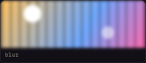 |
| filter-sepia · 375 · guld · default | 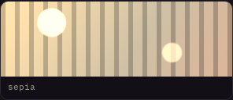 |  |
| filter-invert · 375 · syra · default | 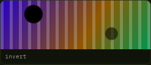 |  |
| filter-drop-shadow · 1280 · guld · default | 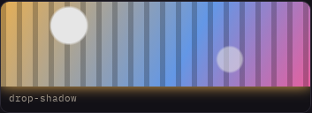 |  |

## 8. Standalone snippets: painted evidence per filter

`tests/demo-source.mjs` extracts the real generated textarea, combines it with
the real Grundpaketet and loads it as its own document. For all eight it
asserts: one swatch, 350×96 px surface, the complete four-layer motif in order
(compared against a probe-computed reference, not a string), only its own
filter declaration, `--lv` absent from the copy, every `var()` resolved, the
nine expected selectors and nothing from another demo.

It then paints: two clones of the demo surface in the same document at whole
pixel positions — one with the demo's filter class, one without — and reads
the pixels back through a canvas. Measured, per filter (Chromium 153.0.8010.0;
`standalone/computed-styles.json` holds the computed values and
`standalone/<id>.png` the rendering):

| Demo | Standalone rendering | Computed filter | Painted assertion (measured) |
| --- | --- | --- | --- |
| filter-blur | 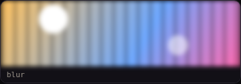 | `blur(3px)` | sharpness 5.12 vs 9.26 unfiltered |
| filter-contrast | 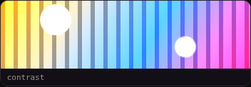 | `contrast(2.1)` | luma σ 45.86 vs 30.01 |
| filter-saturate | 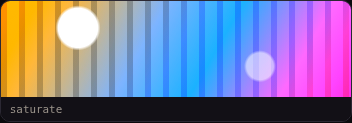 | `saturate(2.6)` | mean saturation 142.18 vs 69.65 |
| filter-hue-rotate | 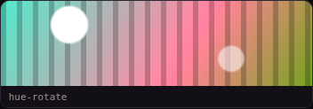 | `hue-rotate(120deg)` | mean hue 248° → 11.7° (123.7°) |
| filter-sepia | 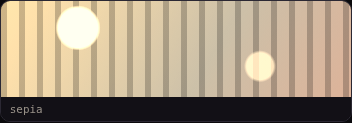 | `sepia(0.85)` | r−b 50.28 vs −25.99, saturation 50.28 vs 69.65 |
| filter-grayscale | 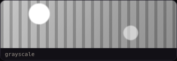 | `grayscale(1)` | saturation 0 (max 0), luma 161.82 vs 161.82 |
| filter-invert | 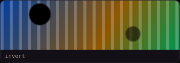 | `invert(1)` | mean \|px − (255 − original)\| 0.13, change 87.75 |
| filter-drop-shadow | 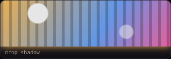 | `drop-shadow(rgb(255, 194, 94) 0 0 8px) brightness(0.9)` | luma 145.66 vs 161.82 (×0.90); shadow ring 32.72 luma / 26.31 warmth vs 0 |

The drop-shadow ring is measured with the swatch's `overflow: hidden`
neutralised in **both** clones: on the live page the glow is clipped by that
ancestor, which is pre-existing behaviour and unchanged by this batch.

Live laboratory behaviour is asserted on the page: the radio group sets
`--lv`, and the computed filter equals a probe-computed reference for
`--lv: 0`, `--lv: 8` and the page's default step — e.g. blur 0/3/8 px,
contrast 0/200/400 %, hue-rotate 0/135/360°, drop-shadow radius 0/8/16 px.
`tests/demo-source.mjs` also asserts, in the live document, that the motif is
published by exactly one rule (`.f-motiv .swatch-yta`), that exactly eight
cards carry the class and that all eight surfaces have four layers and an
active filter.

## 9. Commands and limitations

- `npm run build`, `npm run build:check`, `npm run check`: green (1,298 build
  assertions, inventory-driven).
- `npm run test:browser`: green — menu-keyboard, ux-polish, register-nav,
  demo-source (30 demos, page + standalone) and demo-parity (43,356 values).
- No CI workflow change was needed: the workflow already runs every script
  used here.
- The local Playwright default-executable scripts (menu-keyboard, ux-polish,
  register-nav) were run against the same verified Chromium 153.0.8010.0 by
  pointing the local Playwright browser cache at it; no repository code was
  changed to arrange that.
- Limitations: (1) the DOM is intentionally not byte-identical — one class
  token on eight elements, documented above and covered by a narrowed test;
  (2) the dead `.filter-row` layout rule is left in the stylesheet, deferred
  as in the gradient batch; (3) browser-support metadata is untouched; (4)
  `color-mix-kontinuerligt` and the remaining 103 non-Group-B demos are out of
  scope.


## Reproduce (repository root, Linux)

```sh
npm ci
npm install --prefix .cache/browser --no-save @sparticuz/chromium@153.0.0
node --input-type=module <<'JS'
import c, { inflate } from './.cache/browser/node_modules/@sparticuz/chromium/build/index.js';
console.log(await c.executablePath());
console.log(await inflate('.cache/browser/node_modules/@sparticuz/chromium/bin/al2023.tar.br'));
JS
export LD_LIBRARY_PATH=/tmp/al2023/lib${LD_LIBRARY_PATH:+:$LD_LIBRARY_PATH}
export CHROMIUM_PATH=/tmp/chromium
# Never extract the migrated index as "before". The capture script asserts its SHA.
git show c27b31092cfc275c40dd07f8eeeac5cd5323e3f9:index.html > .cache/pre-filter.html
node docs/migrering/grupp-b-filter/evidence.mjs before .cache/pre-filter.html .cache/review-filter
node docs/migrering/grupp-b-filter/evidence.mjs after index.html .cache/review-filter
node docs/migrering/grupp-b-filter/evidence.mjs compare .cache/review-filter   # exit 1 if any PNG pair differs
for id in filter-blur filter-contrast filter-saturate filter-hue-rotate \
         filter-sepia filter-grayscale filter-invert filter-drop-shadow; do
  node tests/demo-parity.mjs --strict --require-same-browser --demo "$id"
done
```

The evidence utility is opt-in documentation, not a new build system or CI
entry point. PNG pixel statistics can be reproduced with any lossless RGBA
decoder: count pixels with any unequal channel and the maximum absolute
channel delta, without resizing, masking or tolerance. The PNG byte comparison
itself uses only `Buffer.equals`.
