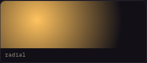
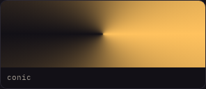
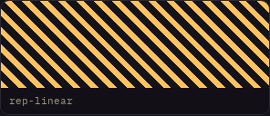
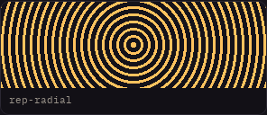

# Group B — remaining four gradients

## Provenance and inventory

- PR #9 verified `MERGED`; starting main/session commit:
  `61aee01f1fcae8a9364ad2201e7f14cf79ecc966`.
- Untouched starting `index.html` SHA-256:
  `8b1d567a0f54df0ff3261edddcd32f416efb92f9f5d0d30a203905f31756ded9`.
- Verified before edits: 133 live demos, 134 register entries, 18 sources,
  four remaining gradients and eight remaining filters, zero runtime JS.
- After: 133 / 134 / **22 sources**; **all five gradients canonical**;
  **eight Group B demos remain, all filters**; zero runtime JS.
- Browser: npm-distributed `@sparticuz/chromium@153.0.0`, with extracted
  AL2023 libraries. Playwright 1.63.0 `browser.version()` verified
  **153.0.8010.0** before capture. No dependency/package-lock changes.
- Four separate `--capture --merge --demo ID` calls ran before changing
  `index.html` or creating the sources. Only the inventory and browser scenarios
  had been extended to allow capture. All four mergeLog hashes match the above.
  All 18 previous baseline entries, previous mergeLog records and top-level
  provenance were compared with the starting commit and remain unchanged.

## CSS ownership map

| Owner | Rules / consumers | Treatment |
| --- | --- | --- |
| Existing `swatch.css` | `.swatch`, `.swatch-yta`, `.swatch-lbl`: block display, border, clipping, radius, base height, label typography/colors. All 16 Group B cards consume them. | Referenced, not duplicated; published exactly once. |
| Existing `swatch-solo.css` | `.swatch-solo`, direct `.swatch` child, descendant `.swatch-yta`: max 22rem, block display, 6rem surface. Five gradients + eight filters. | All five gradient sources explicitly include both fragments. |
| `radial-gradient.html` | `.grad-2 .swatch-yta`: circle at 30% 30%, accent → bg2 at 75%. | Own `<style>`; copied. |
| `conic-gradient.html` | `.grad-3 .swatch-yta`: from 90deg, accent → bg2 → accent. | Own `<style>`; copied. |
| `repeating-linear-gradient.html` | `.grad-4 .swatch-yta`: 45deg, accent 0–6px, transparent 6–14px. | Own `<style>`; copied. |
| `repeating-radial-gradient.html` | `.grad-5 .swatch-yta`: centered circle, accent 0–3px, transparent 3–9px. | Own `<style>`; copied. |
| Per-source laboratory override | `.labbar.grad-2` through `.labbar.grad-5`: `--lv` changes center x, starting angle, stripe/ring periods. | `<style data-live>`, never copied. Original selectors/declarations retained. |
| Page scenography | `.enh-band`, `.enh-mitt`, `.enh-deg45` counters, shared `.labbar` counters/`--lv`, radio controls, auto controls, illustrations, support information. | Remains page-owned, unchanged. |
| Legacy row layout | `.grad-row`: no live class consumer found (the gradients use solo swatches). | Not imported into snippets; unrelated cleanup deferred. |
| Unmigrated filters | `.filter-row`, nine-selector four-layer background motif (row + eight `.f-*` surfaces), eight filter declarations, eight `.labbar.f-*` overrides; solo/swatch fragments and page counters also required. | Entire filter/laboratory CSS block and all eight article strings byte-unchanged against starting document. No filter-motiv fragment introduced. |

The four base rules remain in the same chapter location. Each lab override is
now adjacent to its corresponding base rule, as in linear-gradient. No selectors
cross-match another gradient. Specificity remains three classes for lab rules
versus two for base rules; the effective cascade is unchanged.

## Actual snippet drift

All four old textareas carried the entire chapter CSS: other gradients,
color-mix, relative colors, gamut and obsolete filter snippets. Their base
`.swatch` and `.swatch-yta` copies omitted `display:block`; solo overrides
already supplied block display, so these four surfaces did **not** collapse.
The new copies contain the exact shared fragments, the standard `.demo-yta`
base rule, original markup and just their own gradient declaration.

Existing intentional live/copy differences are preserved: copied radial center
is 30% 30%, but default lab `--lv:2` uses 25% 40%; default conic `--lv:2`
uses 90deg. Repeating-linear's lab default `--lv:2` uses 6/14px like the copy;
repeating-radial's lab default `--lv:2` uses 3/8px, whereas the copy uses 3/9px.
Those are existing lab/example choices, not changes introduced here.
The old filter snippet drift is a separate known issue left for its batch.

## Independent snippets and regression tests

`tests/demo-source.mjs` extracts the actual generated textarea content, combines
it with the actual Grundpaketet and loads a separate minimal document. For all
four it checks expected gradient type, colors, position/angle and stops;
nonzero width and 96px surface height; 352px max-width and 1px border;
resolved custom properties; no `--lv`; and absence of foreign chapter rules.
It also screenshots the surface and reads its **interior pixels** through a
canvas: radial 723 colors, conic 678, repeating-linear 2, repeating-radial 2.
Thus the assertion is about paint, not merely valid syntax.

Live tests exercise both lab extremes. All eight unmigrated filters are checked
for their layered motif, active filter and nonzero shared geometry.
Inventory-driven static tests cover source/snippet derivation, all five
fragment declarations, exact snippet selector ownership, single publication,
source/fragment stale detection, 133 demos, navigation and zero runtime JS.
The orphan-fragment negative test was generalized to remove **all** consumers;
it previously assumed a fragment with exactly one canonical consumer existed.
Its rejection assertion was retained, not weakened.

## Measured parity and visual evidence

Each new demo independently passed:

```sh
node tests/demo-parity.mjs --strict --require-same-browser --demo ID
```

**1,412 values per demo, four states (default, lv-0, lv-8, syra), zero
style/DOM deviations and zero-pixel geometry deviation**, Chromium 153.0.8010.0.

The screenshot matrix contains **72 pairs**: four demos × 375/768/1280px ×
guld/syra × default/lv-0/lv-8. These are `.demo-yta` captures, not whole pages.
All 72 DOM/all-computed-style/relative-geometry hashes are identical.
**65/72 PNG pairs are byte-identical**. The other seven differ at 2–14 pixels,
maximum absolute channel delta **1/255**, at rounded edges. See
`pixel-differences.json`. No tolerance masks or normalized images were used.
The comparison command intentionally returns nonzero when PNG bytes differ.

A control recapture of the untouched pre-migration document for those seven
samples is recorded in `control-before.json`: five changed from their original
before PNG to exactly the after PNG, while two matched the original before.
This demonstrates pre-page raster variability in five cases; it is not proof
that all remaining differences are environmental. **We do not claim full
pixel identity.** No historical baseline was recaptured to conceal differences.

`before.json` / `after.json` preserve document and all screenshot/measurement
hashes. Only five representative pairs are committed: all four default mobile
surfaces and one differing desktop radial pair (10 small PNG files). The full
matrix can be reproduced below without storing 144 binaries in Git.

| Demo (375px, guld, default) | Before | After |
| --- | --- | --- |
| radial |  |  |
| conic |  |  |
| repeating-linear |  |  |
| repeating-radial |  |  |

Differing desktop example (13 pixels, max delta 1):
[before](before/radial-gradient.1280.guld.8.png) /
[after](after/radial-gradient.1280.guld.8.png).

## Reproduce (repository root, Linux)

```sh
npm ci
npm install --prefix .cache/browser --no-save @sparticuz/chromium@153.0.0
node --input-type=module <<'JS'
import c, { inflate } from './.cache/browser/node_modules/@sparticuz/chromium/build/index.js';
console.log(await c.executablePath());
console.log(await inflate('.cache/browser/node_modules/@sparticuz/chromium/bin/al2023.tar.br'));
JS
export LD_LIBRARY_PATH=/tmp/al2023/lib${LD_LIBRARY_PATH:+:$LD_LIBRARY_PATH}
export CHROMIUM_PATH=/tmp/chromium
node --input-type=module <<'JS'
import { chromium } from 'playwright';
const b = await chromium.launch({ executablePath: process.env.CHROMIUM_PATH });
console.log(await b.version()); // Must be 153.0.8010.0
await b.close();
JS
mkdir -p .cache
# Never extract the migrated index as "before". The capture script checks its SHA.
git show 61aee01f1fcae8a9364ad2201e7f14cf79ecc966:index.html > .cache/pre-gradient.html
node docs/migrering/grupp-b-gradients/evidence.mjs before .cache/pre-gradient.html .cache/review
node docs/migrering/grupp-b-gradients/evidence.mjs after index.html .cache/review
node docs/migrering/grupp-b-gradients/evidence.mjs compare .cache/review
# A PNG mismatch returns 1 and lists samples; all measurement hashes are strict.
for id in radial-gradient conic-gradient repeating-linear-gradient repeating-radial-gradient; do
  node tests/demo-parity.mjs --strict --require-same-browser --demo "$id"
done
```

The evidence utility is opt-in documentation, not a new build system or CI entry
point. Optional `SAMPLES=name1,name2` limits control recaptures; use a **separate**
output directory. Do not run `--capture` against the migrated published page.
PNG pixel statistics can be reproduced with any lossless RGBA decoder: count
pixels having any unequal channel, and the maximum absolute channel delta,
without resizing, masking or tolerance. The full PNG byte comparison itself
uses only Node Buffer equality.

## Commands, limitations and next step

- `npm run build`, `npm run build:check`, `npm run check`: pass.
- `npm run test:browser`: pass in Chromium 153.0.8010.0, 32,060 parity values,
  no structural deviations. The standalone paint assertions also pass.
- Existing historical geometry warnings remain visible: this run reports seven
  outside tolerance (target and appearance-base-select), max 22.09px; three
  within tolerance. Earlier calc-size cross-environment warnings in
  `docs/demo-kalla.md` are retained. None affect the four new strict comparisons.
- No CI workflow changes. GitHub CI result is reported in the PR after push.
- Full local browser suite: the three older navigation/UX scripts use Playwright's
  default executable rather than CHROMIUM_PATH. Locally their headless-shell cache
  executable was symlinked to `/tmp/chromium` with the same AL2023 library path;
  no repository code was changed to arrange that environment.
- Screenshot scope is demo surfaces, not whole pages or open code vaults (whose
  content and textarea row count intentionally change). Browser-support claims,
  color-mix-kontinuerligt, contextual navigation and register remain untouched.
- Next: separately migrate the eight filters, first assigning ownership of the
  shared four-layer background motif and capturing their untouched baselines.
